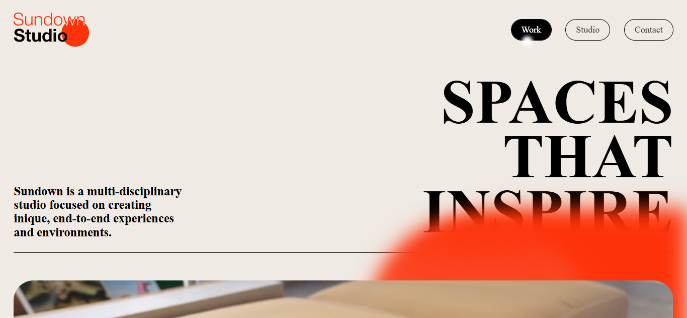
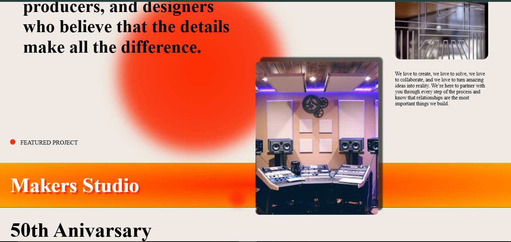
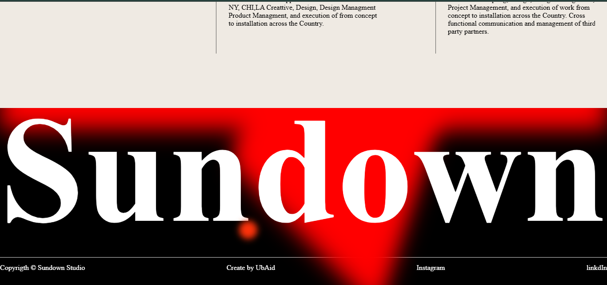

# Sundown Studio
# 🌐 Responsive Webpage with Locomotive.js, Swiper.js & GSAP

This project is a fully responsive modern webpage built with **HTML**, **CSS**, and **JavaScript**, enhanced with smooth scrolling animations using **Locomotive.js**, engaging sliders with **Swiper.js**, and creative motion effects with **GSAP**.

---

## 🚀 Features
- **Responsive Design** – Works seamlessly on desktop, tablet, and mobile devices  
- **Smooth Scrolling** – Implemented with *Locomotive.js*  
- **Interactive Sliders** – Powered by *Swiper.js*  
- **Beautiful Animations** – Created using *GSAP*  
- **Optimized Performance** – Lightweight and fast  

---

## 🛠 Technologies Used
- **HTML5**
- **CSS3**
- **JavaScript**
- **GSAP**
- **Locomotive.js**
- **Swiper.js**
  
---

## 📸 Screenshots
      

---

## Live Demo
[Click here to view the live project]( https://ubaid0542.github.io/Sundown-Studio/)
